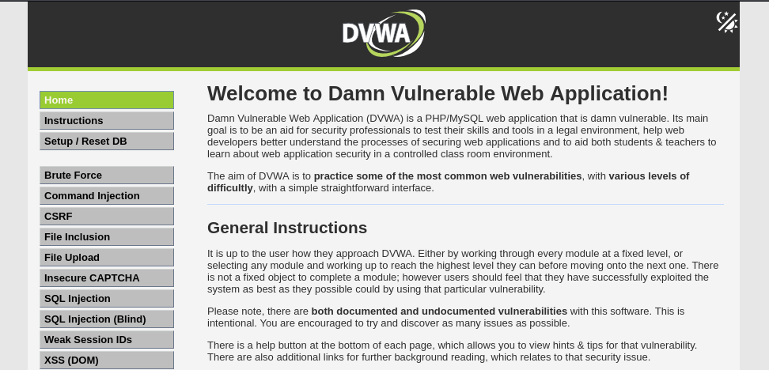
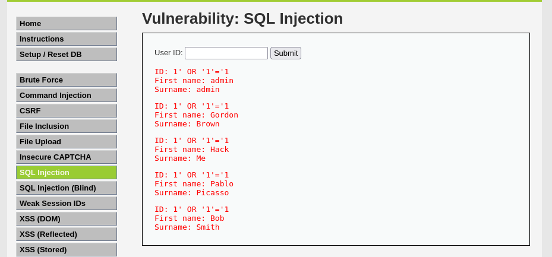
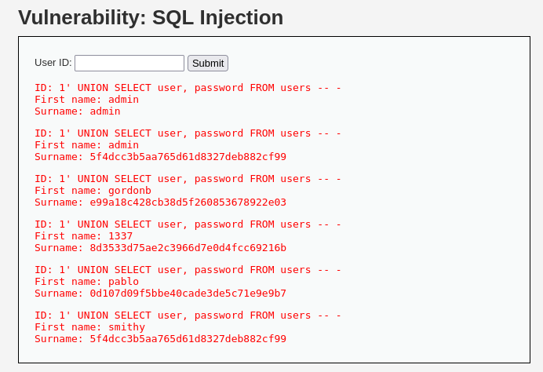

# SQL Injection on DVWA
- This exercise seeks to demonstrate a SQL injection Vulnerability on the intentionally vulnerable `user id` search box under `SQL Injections` on DVWA.

## First Steps
- I'll be doing this on a kali machine which hosts DVWA html and php files. More information on how to setup DVWA on a kali machine can be found on:
[Installing DVWA in a Kali VM](https://youtu.be/WkyDxNJkgQ4?si=KuYhGs1ZL7fpwB4p).
- After successful setup & login, you should see this: 

## Injection && Analysis
- To perform the injection, we're going to head over to the SQL injection section by accessing it on the left panel of the page. On landing, we should see
a basic UI showing a simple search box for a User ID. `User ID:___________ | SUBMIT` This is where we're going to practise our SQL injections.
- By the look of this, the SQL query is (probably) `SELECT * FROM users WHERE user_id='$input';`, by the basis we can try a simple injection to retrieve
all users in the database:

        ```
        1' OR '1'='1
        ```

- This evaluates to `SELECT * FROM users WHERE user_id='1' OR '1'='1';`. The SQL query selects all columns from the `users` table where the row has a
`user_id` of `$input`, so it returns the single row with the specified `$input`. But for our input here contains an `OR`, so the query essentially returns
all rows that satisfy the `WHERE` clause, here the input evaluates to true if either expression on both sides of `OR` evaluate to true, in that case every
row satisfies the `WHERE` clause hence returning all users and their details. Below is the output after entering the injection input: 

- Looking at the output above indicates that input isn't properly sanitized and we can employ more specific and complex injections to retrieve the type of
data we want. Next up, we'll trying injecting an input that retrieves all users' password hashes.(An attacker can later decrypt these offline if they manage
to retrieve them).
- But before we proceed there's a juicy detail worth noting that can be seen by observing the output keenly, the(more probable) SQL query behing the User ID search box is `SELECT first_name, last_name FROM users WHERE user_id='$input';` seeing that each output has two values, 'First name' & 'Surname'. So our initial guess was slightly incorrect.
- Now, onto our second injection, we're going to input:

        ```
        1' UNION SELECT user, password FROM users-- -
        ```

- Here is the output: 

- The injection was successful, we get a list of all the users and their password hashes. Lets break down the injection and how it works, including our
injection input, the entire query becomes `SELECT first_name, last_name FROM users WHERE user_id='1' UNION SELECT user, password FROM users-- -';`.
- The `UNION` appends the result of two `SELECT` clauses provided return the same number of columns. The query first returns the First name & surname of
`user_id` '1'(which is 'admin') then retrieves all users and their respective password hashes. `-- -` comments out the last `'` so the injection doesn't
break SQL query syntax.
- The page then displays both result sets using "First name & surname" labels regardless of what the data actually is.

## Conclusion
- This exercise demonstrated exploiting SQL injection vulnerabilities by injecting SQL syntax on an intentionally insecure web app, making it expose data
it was never intended to show by manipulating underlying query. The root cause was simple, unsanitized user input. A real world fix would using prepared
statements, which separate SQL code from user input so injected syntax is never interpreted as part of the query.
